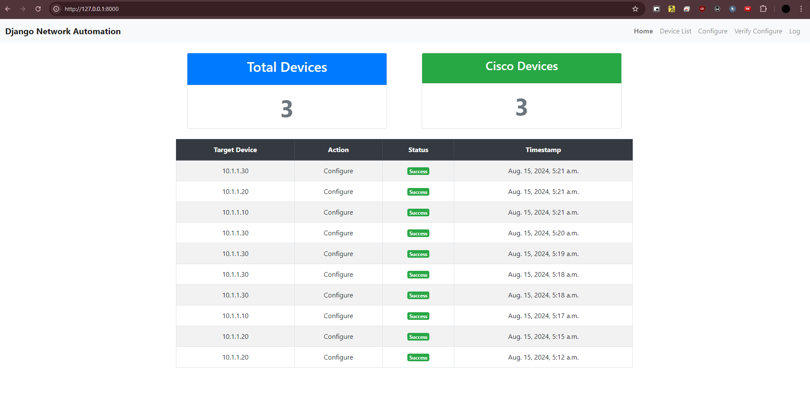
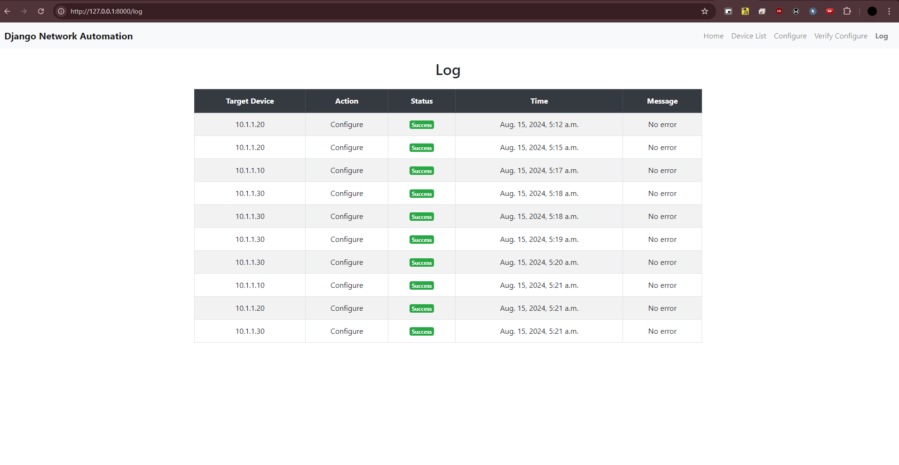

# django_network_auto

## Overview

This project is a Django-based network automation tool. It allows you to configure and verify network devices using a web interface.

## Prerequisites

- Python 3.x
- Django
- Paramiko
- GNS3 with Cisco i86 routers L3

## Installation

1. Clone the repository:

    ```sh
    git clone https://github.com/yourusername/django_network_auto.git
    cd django_network_auto
    ```

2. Create a virtual environment and activate it:

    ```sh
    python -m venv venv
    source venv/bin/activate  # On Windows use `venv\Scripts\activate`
    ```

3. Install the required packages:

    ```sh
    pip install -r requirements.txt
    ```

4. Apply the migrations:

    ```sh
    python manage.py migrate
    ```

5. Create a superuser:

    ```sh
    python manage.py createsuperuser
    ```

6. Run the development server:

    ```sh
    python manage.py runserver
    ```

7. Open your browser and navigate to `http://127.0.0.1:8000/` to access the application.

## Usage

1. Log in to the admin interface at `http://127.0.0.1:8000/admin/` and add your network devices.
2. Use the web interface to configure and verify the devices.

## Tested Environment

This project was tested using GNS3 with Cisco i86 routers L3.

## Images

Here are some screenshots showing how the application works:

### Home Page


### Device Configuration


### Log Page


## License

This project is licensed under the MIT License.